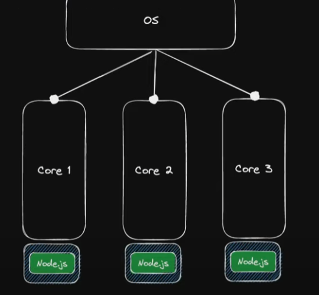

# CLUSTER SERVER

Los OS trabajan con uno o mas CORES (Núcleos). Simpre que iniciemos un proceso con NODE JS, este puede recibir muchos *peticiones*, o **REQUEST**, por parte del cliente que consuma recursos (dependerá del trafico que tenga), este proceso se ejecutará en uno de los CORES, pero, mientras tantos, los demás siguen inactivos. Entonces, deberíamos poder utilizarlos para dividir el trabajo, y no centrarlo en un solo CORE, que posiblemente colapse por tantas peticiones juntas.
Las arquitecturas modernas consisten en varias replicas de ese servidor NODE, que se asignan a cada uno de esos CORES disponibles.





Esto es lo que se llama **CLUSTER**, varios servidores interconectados, responsables de atender las peticiones del cliente. Esto no quiere decir que cada uno de estos procesos sepa la existencia del otro, solo comparten los recursos.


## EJECUTANDO LOG COMMAND

```bash
npx loadtest -n 1200 -c 400 -k http://localhost:3000/heavy
```

El *-n* es el número de peticiones, y la *-c* es la concurrencia, y por último, la ULR donde queremos analizar.


## Ejecutando el CLUSTER

En el archivo *primary.js*, tenemos la inicialización de los cluster, haciendo referencia a donde tenemos el código de nuestro servidor. En mi caso, se van a ejecutar 6 CLUSTERS, dado que mi ordenador solo tiene 6 núcleos.