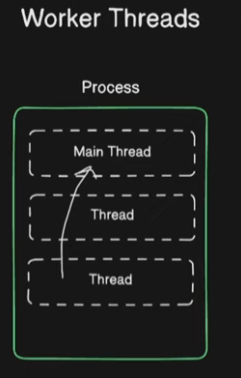
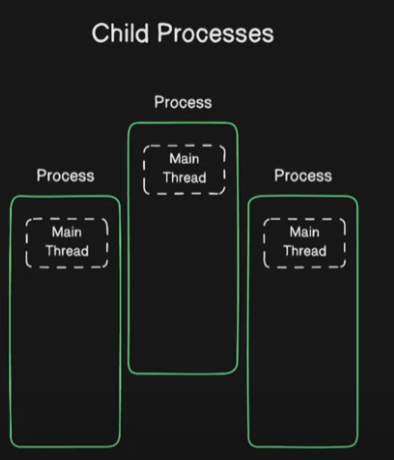

# Child Process

Puede ser utilizado para algunos procesos mas específicos, como algun cálculo pesado, todo esto, con el objetivo de no afectar al proceso principal, o simplemente algo isolado.
No hay que confundir con los *SUBPROCESOS*.

En los WORKER THREADS podemos tener procesos, que son los MAIN THREADS, que también pueden ser creados procesos adicionales, que se comunican entre sí, cualquier error que ocurrira en alguna *THREADS* afectaría a las demás.

{style="display: flex; justify-content: center;"}

En los CHILD PROCESSES, estamos poniendo em marcha un proceso nuevo, que va estar junto a un proceso anterior.

{style="display: flex; justify-content: center;"}

Se crea un proceso de aislamiento, en el cual cada uno tiene su lugar y su memoria. Es por ello, si alguno fallará (por algún error), los demás no se verían afectados, estarían completamente *isolados*.

- **Casos de uso**: Podemos utilizar el *CHILD PROCESS* cuando necesitemos completa isolación o utilizar procesos externos. Seleccinaremos *WORKER THREADS* para computos paralelos dentro de único proceso.
- **Utilización de recursos**: Tipicamente contiene alto consumo de recursos encima, comparado con *WORKER THREADS*, debido a la creación de un proceso (que suele ser muy complicada), y la administración del mismo.
- **Complejidad**: Es simple de implementar y administrar, comparado con *WORKER THREADS*, el cual requiere un cuidadoso manejo, memoria compartida y sincronización. 

