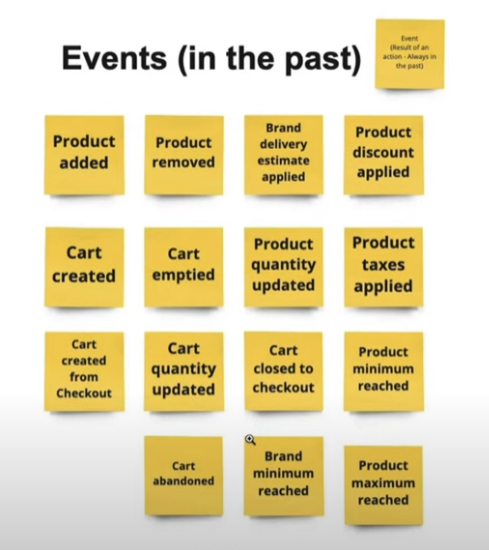

# DOMAIN DRIVEN DESIGN

En los ejemplos, se utilizará una APP que entrega pedidos con DRONES.

El ***DDD*** tiene como objetivo mejorar la calidad de nuestro software, alineandolo estrechamente con las necesidadesd el negocio.

Consiste en dos partes:

- *Strategic Design* --> Descripción general del DOMINIO, o la APP en un nivel superior.
- *Tactical Design* --> Descripción general del DOMINIO, o la APP en un nivel inferior.

Siempre se empieza por el *Strategic* para comprender las necesidades del negocio, saltamos al *Tactical* cuando queremos estar mas cerca del código.

En *Strategic Design* siempre se hablará de problemas, y no de soluciones. Lo que se hace, basicamente, es una *EVENT STORMING* (no confundir con *BRAIN STORMING*), en donde se trata de poner EVENTOS que estan sucediendo en nuestro sistema.

Esa es una serie de eventos en *e-commerce*... (*ver mas en el siguiente video: https://www.youtube.com/watch?v=l93N4XaQJok&ab_channel=SoftwareDeveloperDiaries*)