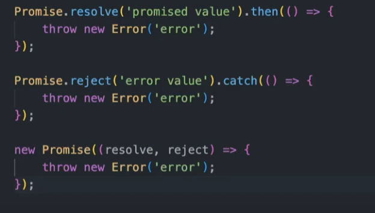

# Error Handling on NODE JS



Todos estos erros, si son llamados, van a aparecer en la consola. Igualmente, va a depender de donde, o en que entorno se este ejecutando NODEJS.

**Para realizar validaciones, tener en cuenta la siguiente libreria**

```bash
npm i ajv
```

## LOGGERS recomendados

Tener en cuenta el siguiente LOGGER para poder visualizar mejor el ERROR.

```bash
npm i winston
```

O también:

```bash
npm i pino
```

## Buenas Practicas en el TDD

Siempre que hacen tests, es bueno tener en cuenta los posibles ERRORES, y no siempre los escenarios felices.
*index.spec.ts*

```ts
test("that the web server fails on start", async () => {
    // Arrange
    await api.startWebServer()
    const loggerDouble = sinon.stub(logger, "error")
    const errorToThrow = new Error("An error that wont be cought 😳")
    
    // Act
    process.emit("uncaughtException", errorToThrow)
    
    // Assert
    expect(loggerDouble.calledWith(errorToThrow))
})
```