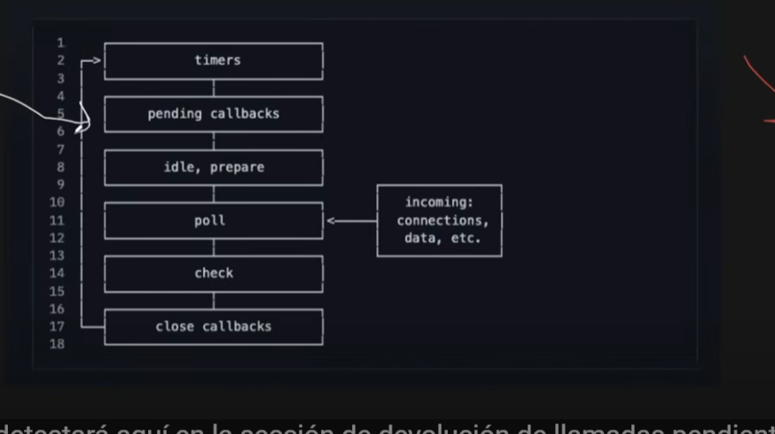

# EVENT LOOP

Son muchos pasos que se realizan y que ocurren cada milisegundo cuando corremos una aplicación de NODE JS.
Siempre que la aplicación inicia, tambien lo hace el LOOP.

Las PROMISES toma la ejecución que contenga y la mueve afuera del EVENT LOOP, para que este pueda continuar.