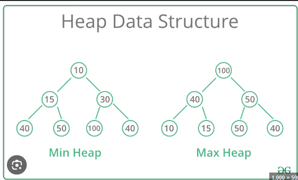

# MEMORY OPTIMIZATION


La memoria en NODE JS se ve como una HEAP (*montón*), un HEAP de NODES.



Hay casos en los cuales, hay una cierto NODO que no se elimina y queda como una **MEMORY LEAK**, o fuga de memoria. Supongamos que tenemos TIMERS (*setTimeout, setInterval, etc.*) en nuestro código, y no son borrados correctamente, otro caso son las variables globales.

Las RECOLECCIONES DE RESIDUOS son fundamentales para evitar el MEMORY LEAK, eso significa que ya no hay referencias a esos NODOS que ya no están.

Para poder tener una metrica para ver el uso de memoria, podemos utilizar:

```bash
$ node --trace_gc index.js
```

Se le hace un seguimiento al RECOLECTOR DE BASURA, o el GARBAGE COLLECTOR *gc*.


## Diagnosticar una aplicación NODE JS

El motor en el cual funciona NODE JS, tiene la capacidad de mostrarnos unas instantáneas de la memoria utilizada. Es el **v8.writeHeapSnapshot method**, también, podemos utilizar el inspector.

```bash
$ node --inspec index.js
```