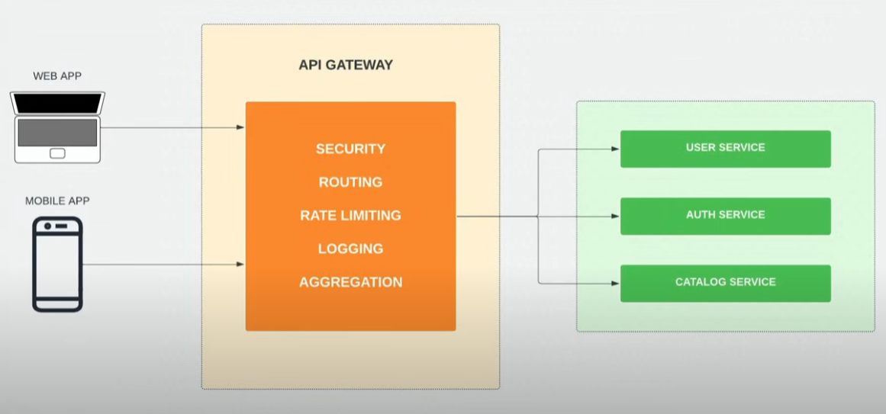
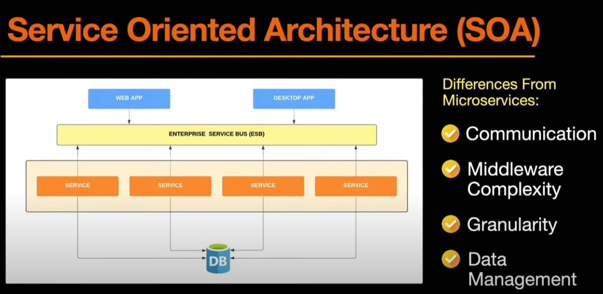

# Microservices

Para entender mejor, primero tenemso que saber que es una arquitectura monolitica, que es donde todo el código esta estrechamente acoplado, es lo mas convencional para un desarrollador. Son faciles en su proceso de desarrollo, despliegue y testing. Hay un claro entendimiento, por parte del desarrollador, de la aplicación y su funcionalidad, su mantenimiento es también de lo mas sencillo.
EL inconveniento es cuando la aplicación debe emepezar a escalar, aquí es donde pueden encontrarse muchas limitaciones.

En todo caso, si las aplicaciones son mas complejas y escalables, lo mas recomandado es utilizar *MICROSERVICES*.


## Arquitectura de MICROSERVICES

Es una colección de servicios acoplados de forma flexible, que se acoplan en funciones comerciales específicas. Cada *SERVICE* puede escalar independienemente, y cada uno es responsable de un dominio específico o funcionalidad dentro de la aplicación, pero pueden comunicarse a través de una red utilizando protocolos como HTTP. Todo esto permite la escalabilidad y mejora de rendimiento.
No estan atado a ninguna estructura, ni tampoco a ningún lenguaje en específico.
Entre las desventajas, podría ser que agregue cierta complejidad a la aplicación, es por eso que puede ser innesaria para proyectos pequeños, además de ser muy costosa, en términos de recursos, para operar.




## SERVICE ORIENTED ARCHITECTURE (SOA)



Desde siempre se ha relacionado el SOA con la Arquitectura de los Microservicios, pero la principal diferencia es la comunicación, por los *MICROSERVICES* pueden comunicarse entre sí utilizando protocolos, mientras que el SOA utilizando un MIDDLEWARE como ESB (ENTERPRISE SERVICE BUS), esto lo hace mas complejo y falible en ese punto, porque si el ESB falla, todo los servicios también lo harán, eso no ocurre con los *MS*.


## PROS & CONS


## Proyecto utilizando MICROSERVICES

En el mundo del desarrollo web, NODE JS es muy popular, este último combinado con la librería *EXPRESS* pueden ser las mejores opciones. Pero en este caso vamos a utilizar la librería *Moleculer*.

```bash
npm install moleculer
```

Esta librería esta diseñada para crear aplicaciones con *MS*, otra de las cosas que vamos a necesitar es un *LOAD BALANCER* (Balanceador de carga), que distribuya el trafico de red entrante entre los múltiples servidores o recursos, todo esto podemos encontrarlo en *Moleculer*. Si estuvieramos utilizando *EXPRESS*, podriamos utilizar un *REVERSE PROXY* para estas tareas, como *NGINX*.