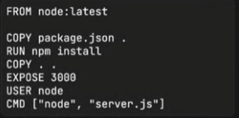
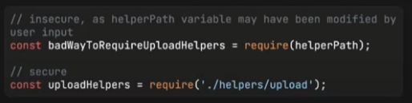

# Mejores Prácticas con la SEGURIDAD EN NODE JS | Parte 2


## Running Node JS as non-root User

Cada vez que iniciamos NODE JS en el entorno local, problamente lo estemos haciendo como el usuario del ordenador que estamos utilizando. Pero si lo hacemos desde un contenedor DOCKER, por ejemplo, estas últimas tienen definido un usuario ROOT definido por defecto. Lo malo en eso es que, si un atacante consigue hacerse con ese ROOT USER, va a tener acceso a todo lo que este ROOT USER tiene acceso, o sea, puede hacer muchisimo daño, el control es casi total sobre el servidor.
Para evitar esto, y sobre todo si estamos utilizando DOCKER, es limitar los privilegios de ese USER ROOT.




**Tratar de evitar el puerto 80 en servidores, utilizar en su lugar el 3000.**


## Module Loading with a variable



No hay que darle la posibilidad a un usuario atacante de especificar que archivos quiere cargar.


## Payload size Limiting

En anteriores veces, se mencionó de limitar la cantidad de REQUEST que puede recibir el servidor, todo esto para evitar los ataques de DOS. Lo mismo ocurre con este item, el tamaño del archivo recibido, tambien puede perjudicar el normal funcionamiento del servidor, y es por eso que se debe limitar al usuario. Podemos utilizar la siguiente librería para ese propósito.

```bash
npm i rat-limiter-flexible
```

## Authentication Limits

Ahora, siguiendo con el ámbito de las limitaciones, pasamos a la AUTENTICACIONES. Es una buena práctica bloquear una cuenta de usuario cuando este falla repetidamente un intento de AUTENTICACION. Podemos utilizar la libreria anterior para limitar este asunto. 


## HTTP response headers & helmet

```bash
npm i helmet
```

Define todos los HEADERS que uno va a necesitar en un proyecto.


## Vulnerability Inspection

No es tan aplicable en proyectos pequeños, porque normalmente no se utilizan muchos paquetes. Pero, como sabemos, cada paqueteria depende muchos otros paquetes dentro del mismo. Cada uno de estos paquetes dentro de NODE tiene algun problema de vulnerabilidad, que se deben solucionar antes de enviarlos a producción.
Una posible solución sería:

```bash
npm audit [fix | signatures]
```

