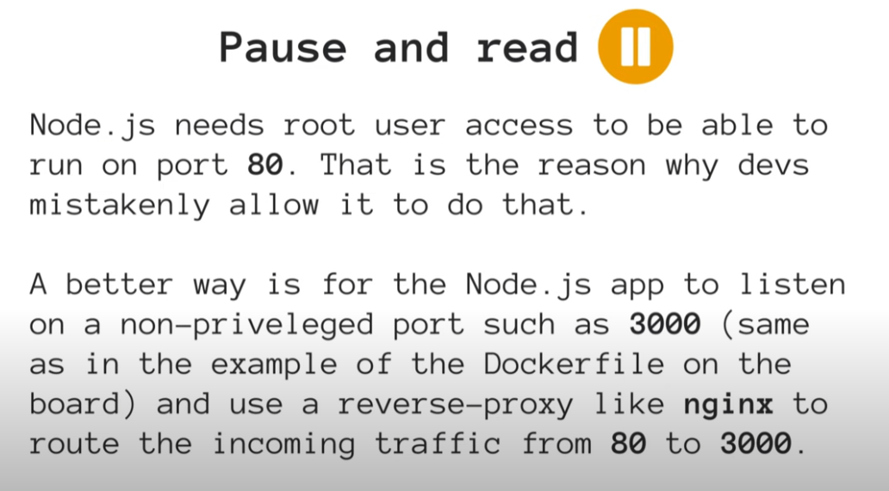

# Mejores Prácticas con la SEGURIDAD EN NODE JS | Parte 2

## Running Node JS as non-root User

Cada vez que iniciamos NODE JS en el entorno local, problamente lo estemos haciendo como el usuario del ordenador que estamos utilizando. Pero si lo hacemos desde un contenedor DOCKER, por ejemplo, estas últimas tienen definido un usuario ROOT definido por defecto. Lo malo en eso es que, si un atacante consigue hacerse con ese ROOT USER, va a tener acceso a todo lo que este ROOT USER tiene acceso, o sea, puede hacer muchisimo daño, el control es casi total sobre el servidor.
Para evitar esto, y sobre todo si estamos utilizando DOCKER, es limitar los privilegios de ese USER ROOT.
