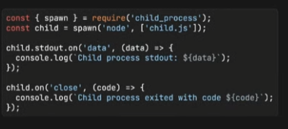

# Mejores Prácticas con la SEGURIDAD EN NODE JS | Parte 3

## Security Hardening

Proporciona una mas eficaz seguridad con las aplicaciones NodeJS. Muchas empresas confian esa seguridad a ***OWASP**.
https://github.com/OWASP/ASVS

*Ver también*
https://www.iothreat.com/blog/server-leaks-information-via-x-powered-by-http-response-header-field-s


## Leaking server information

Si una aplicación (puede ser NODE, SPRINGBOOT, PHP, etc.) revela información propia de la misma, como por ejemplo, que tecnología estamos utilizando, a un posible atacante, este puede utilizar alguna vulnerabilidad y ocacionar estragos en nuestro servidor. Incluso, si estamos utilizando algun proxy, como puede ser *NGINX* (*Proxy reverse*), que también puede revelar esa información.
Lo que podems hacer, si estamos usando **Express**, es deshabilitar el *x-powered-by*.

```js
import express from "express"

const server = express()

server.disabled("x-powered-by")

server.get("/hello", (request, response) => {
    response.send("hello")
})

sever.listen(3000, ()=>{
    console.log("Server Listening...")
})
```

Esto evita que obtenga un encabezado expedido por el motor utilizado.


## Ignore with NPM

Ya utilizando el *.gitignore*, que evitar que *empujemos* hacia el repositorio archivos que no son necesarios, o muy costosos en espacio. Hay algo similar con el archivo **.npmignore**, pero esta vez, aplicado a proveedor de paquetiría *NPM*.


## Child Processes



