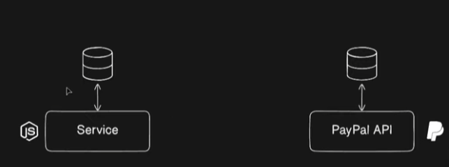

# Solving Common Backend Issues: Crashes & Downtime

Tomamos un ejemplo de una aplicación financiera, en el que reastrea el dinero gastado. Al mismo tiempo, utilizamos una API de terceros, como por ejemplo, PAYPAL.

Lo que tenemos que hacer, es copiar las transacciones de que hay PAYPAL a nuestra DB. Lo mas común, es utilizar la transmision de eventos con KAFKA de APACHE, que captura los datos en tiempo real.

En el caso de suceda algun error, el usuario podría no visualizar alguna transacción en su cuenta, en nuestra base de datos no aparece, pero si en el ecargado de la transmision de eventos, que en este caso es KAFKA.
Esto puede ser muy problemático, y para solucionarlos debemos recurrir a la *redundancia*. Depender de un solo servidio puede llevarnos a ese ERROR.
Teniendo varios servicios, ya no tendríamos solo un punto de falla, uno podria relevar al otro en caso de ERRORES y caidas de servicio, como es obvio, la solución esta en utilizando **PM2**.